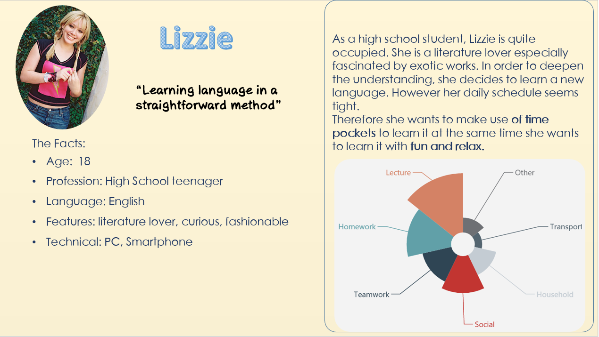
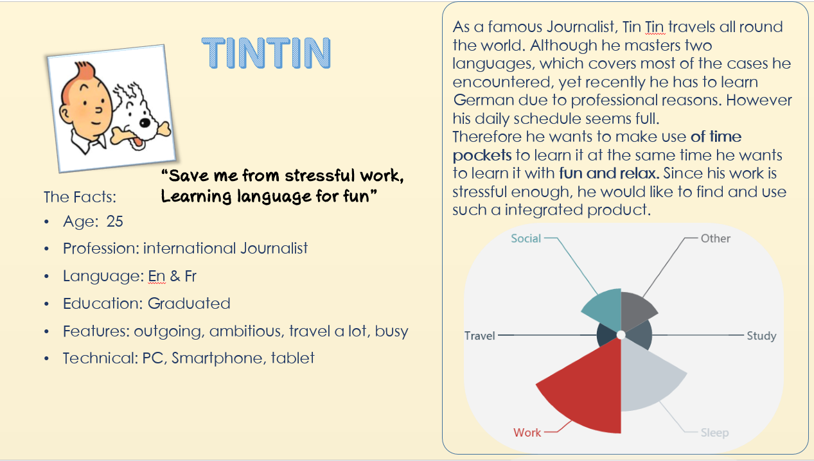

# Lingo Boom
Lingo Boom is a language learning app developed by team DIScovery for the class Designing Interactive Systems at RWTH Aachen University.

Try it out: [Marvel UI Prototype](https://marvelapp.com/77gj0d4), [Unity Gameplay Prototype](https://lingoboom.icaramba.it)

Or watch our video trailer: [Lingo Boom Trailer](https://drive.google.com/file/d/0B-iyrq2lCsklWXctcVZLb293eWM/view)

The basic idea is to simplify learning articles and vocabulary for the German language by repetition. It is designed to allow quick sessions on your mobile device whenever there is a small time pocket.

It's designed for people like [Lizzy](Persona2-sherry.png) and [Tin Tin](Persona-sherry.png), who want to learn a language but not by sitting down and studying for hours.

##The concept
According to professionals we asked, articles are best learned by repeating words and matching them with the right article. The traditional approach used by a lot of students is to write them on paper and cover the article (or translation). Then the student tries to remember the article and check if he is right by uncovering.

Quite often students tend to get stuck on words and miss the learning goals. We want to simplify this process by creating an app that will challenge the user to remember the articles and words and require the user to go through the words as fast as possible.

In a lot of currently existing apps we noticed, that those fail to motivate the user and fail at teaching the user.

Take this negative example from the App Store, where we observed users to discover the problems with existing apps:

The user gets asked a word and has to select the correct article. The words are random. After tapping a word the user gets feedback wether he's right or wrong and gets a new word.

We observed these problems:

* Users get stuck at times when they don't know the correct article
* They spend much time for each word
* Wrong words don't reappear, small learning effect
* a lot of time between selecting one article and getting a new word (~ 2s)

In order to solve these different problems we decided to create a game. In a game it's intuitively possible to provide the user with feedback and to encourage the user not to spend to much time on each word. We want the user to mostly learn the articles subconsciously.

###Initial prototype

In our first concepts we had to competing ideas, one where you get the word and select the article and one where you get an article and find a matching word. We liked the idea of having words falling down towards the player because it sets a time limit which can be perceived without any distraction (compared to e.g. a bar for a time limit).

#### Select Word

In this concept you get new Articles flowing in your gun from the right and have to select one of the Words falling down. This means the user has to read the article and basically "check" every word until he finds a fitting word.
#### Select Article

Here the user sees the words falling down and has to select one of the articles to shoot. In this first iteration the gun pointed automatically at the closes enemy which could not be changed.

###Feedback

After asking some testers we could clearly see that selecting the article is the better fit. There is a clear perceive - classify - select path for every word which can quickly be performed. In the other approach the user needed to be kind of lucky to look at the correct word first, otherwise he needs additional time to look at each word which leads to frustration in such a fast paced game. 

### Further prototypes
After we had collected this feedback and gathered those impressions we needed to create a higher level prototype. We really wanted to test the feeling when playing the game, including the fast pace, that is crucial for the game and the learning experience, therefore we decided to create the game in Unity. We decided to do two separate prototypes, one for the UI Part in Marvel and the Game part in Unity. We iterated quickly over these prototypes and added new features and changed the graphics, therefore these started as medium fidelity prototypes but became high fidelity prototypes in the end. Also have a look at our [Lingo Boom Storyboard](Storyboard.pdf).

In the Unity prototype we observed that at times it is not easy to detect which article is currently selected, therefore we added a crosshair to indicate the currently targeted word. Many users tried to select a different word by tapping on it and requested that they want to be able to select a different word manually. Interestingly, after we added this feature, nobody used it any more. We learned that this feature doesn’t make any sense in the gameplay but if we ask users to test the game they will check if this feature exists - no matter if it is useful.

We observed that many testers that didn’t know German at all quickly started to remember the articles. First, we had planned to add a penalty for shooting a word with the wrong article, but then we observed that it is extremely useful to allow the user to “try” as many articles as he wants, as long as the word doesn’t hit him. As the game is very slow at the beginning at gets faster over time, the user can have multiple tries at the beginning if he doesn’t know the correct article yet. Over time he gets less time per word (because they get faster), so he needs to remember the word and select the right article. By allowing the error at the beginning the user can learn using trial-and-error, which is very effective.

As a consequence, users figured out, that they can just smash the buttons and shoot all the article at the words. Therefore we added a short cooldown time to the gun, which ensures that you will die quickly if just smashing buttons. We animated a small light strip on the gun to indicate the cooldown to the user. This was important to ensure that the user understands why he can not shoot that quickly.

##Final assembly
We managed to link the marvel prototype to the unity prototype to prevent confusing our testers with switching between apps. Our final version offers a seamless UI which lets you choose between different word sets, and offers a truly unique and effective learning experience.

Try it out: [Marvel UI Prototype](https://marvelapp.com/77gj0d4), [Unity Gameplay Prototype](https://lingoboom.icaramba.it)

### Final project presentation
[Project presentation](https://drive.google.com/open?id=0B7_5KwpaJ1xHek1WTWRWb1liam8)
